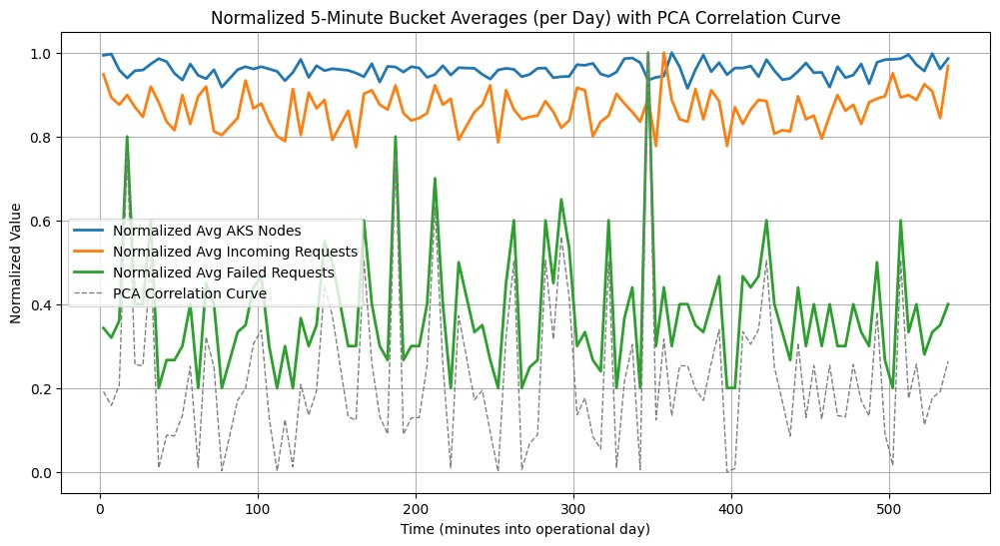

(Or, How We Learned to Stop Worrying and Love the Cloud)

Have you ever wondered how a cloud-based, multi-agent AI service handles a flurry of incoming user requests without spontaneously combusting? Well, wonder no more! In this blog post, we’ll embark on a fun, light-hearted journey through a simulation that tests just how gracefully an AI agentic system (think: a set of AI agents working together) scales, splits, and handles all sorts of query traffic. We’ll talk about our framework, assumptions, code, and results—complete with a snazzy chart to show off our data.

<!--more-->

## The Task at Hand

Imagine you’re running a magical multi-agent AI system in the cloud. Users keep sending in queries, each one with a certain number of tokens, and your AI agents must figure out how to handle them. Sometimes they split requests, if they requre some custom processing, sometimes they drop them if they’re too many of them. We want to figure out:

- How many requests do we get in total?
- How often do we drop requests, having in mind a limited capacity of our compute cluster?
- How does all of this affect our resource usage and total cost (in good old dollars)?

In other words, we want to simulate the day-to-day life of our AI agentic system and see what happens when the going gets tough—or at least, when the queries keep rolling in.

## Our Simulation Framework

For our simulation, we put on our Python hats and set up a playful environment. We used `SimPy` - discrete-event simulation framework based on standard Python. Our main steps looked a bit like this:

1.	Generate incoming requests: We produce a batch of user queries with random sizes (in tokens).
2.	Route the requests: Some requests processed by the Agent which takes them; others are split into multiple sub-agents, to simulate some complex queries.
3.	Cost modeling: We keep track of how many tokens each request uses, then calculate LLM (or multi-agent) costs and AKS (Azure Kubernetes Service) costs based on usage—both in dollars.
4.	Statistics: We record everything—number of direct requests, split requests, dropped requests, total tokens, and costs.
5.	Repeat: We run this entire simulation multiple times (100 runs, in our case) to get nice summary statistics.

This framework gives us a robust way to see how our hypothetical cloud-based AI system behaves under a variety of random conditions.


## Assumptions & Numbers

Now for the fun part—how did we decide which numbers to plug in?

- Token Distribution: We assumed user queries come in a variety of sizes, with a certain average length and standard deviation. The system (i.e., our band of AI agents) might add some overhead tokens for each query because, hey, systems gotta system.
- Split Threshold: We assume that there is a ratio of request which are too complaex and requre complex processig. So we split the stream of requests based in this ratio, randomly.
- Costs in Dollars: We used a made-up cost model for LLM usage and AKS usage. For example, maybe 1 million tokens cost a certain number of dollars, and each AKS node has a cost per hour. We aimed to keep these costs in a plausible range for demonstration purposes.
- Dropping Requests: We allowed the system to drop requests if they were too huge or if the cluster was at capacity. We pretended it was more cost-effective to drop them than to scale to infinity—harsh, but it’s just a simulation!

Our goal was not to create a perfectly realistic production environment, but rather to highlight the trade-offs and behaviors that might emerge under these assumptions.

## A Quick Peek at the Code

We won’t overwhelm you with all the gritty details, but here’s the general shape of our Python code:

```python
import numpy as np
import pandas as pd
from tqdm import trange

NUM_RUNS = 100
results = []

for run in trange(NUM_RUNS):
    # 1. Generate requests
    user_queries = np.random.poisson(lam=5000, size=some_size)  # Just an example

    # 2. Route requests
    direct_requests = 0
    split_requests = 0
    dropped_requests = 0
    total_tokens = 0
    
    # ... Some logic for splitting or dropping requests ...
    
    # 3. Track costs (in dollars)
    llm_cost = ...
    aks_cost = ...
    total_cost = llm_cost + aks_cost

    # 4. Append results for each run
    results.append({
        'direct_requests': direct_requests,
        'split_requests': split_requests,
        'dropped_requests': dropped_requests,
        'total_requests': direct_requests + split_requests,
        'llm_cost': llm_cost,
        'aks_cost': aks_cost,
        'total_cost': total_cost,
        # ... other stats ...
    })

# Convert results to a DataFrame and compute summary statistics
df = pd.DataFrame(results)
summary = df.describe()
print(summary)
```

Essentially:
1. We generate a batch of requests with random sizes.
2. We decide whether to direct them, split them, or drop them.
3. We calculate how many tokens went through and the costs in dollars.
4. We collect all these stats in a DataFrame and spit out summary statistics.

You can find the notebook [here](https://github.com/eosfor/scripting-notes/blob/8d0af479302fd43f40b73627d16f72d8a12c7d79/notebooks/en/agentic-ai-infra-simulation/sim.ipynb)

## Results: The Grand Reveal

After 100 simulation runs, we got some neat summary statistics:

| Metric                | mean       | std     | min       | max       |
|-----------------------|------------|---------|-----------|-----------|
| direct_requests       | 6479       | 85.76   | 6279      | 6641      |
| split_requests        | 25931      | 157     | 25462     | 26347     |
| dropped_requests      | 591        | 38.74   | 506       | 696       |
| total_requests        | 32410      | 182     | 31945     | 32823     |
| percent_split         | 80.01      | 0.23    | 79.46     | 80.60     |
| user_query_tokens     | 3561909    | 53503   | 3445529   | 3669273   |
| system_query_tokens   | 95085770   | 517611  | 93430542  | 96296984  |
| llm_response_tokens   | 42782889   | 225980  | 42077728  | 43267966  |
| total_llm_tokens      | 141430570  | 743063  | 139073264 | 143077558 |
| llm_cost (USD)        | 424        | 2.23    | 417       | 429       |
| aks_cost (USD)        | 858        | 2.32    | 852       | 864       |
| total_cost (USD)      | 1283       | 4.35    | 1269      | 1293      |
| max_nodes             | 11.00      | 0.00    | 11.00     | 11.00     |
| avg_nodes             | 8.01       | 0.02    | 7.95      | 8.07      |

What does all this mean?

- We drop a relatively small number of requests (591 on average), which says that our cluster with all limits we set for it scales fine and most of the time can accomodate the load.
- The total cost in dollars ends up around $1283, with LLM cost at about $424 and AKS cost at about $858. Looks like our AI usage is cheaper than our compute infrastructure in this scenario!
- Max nodes at 11 suggests we capped our cluster at 11 nodes. On average, we only used about 8 nodes, which means we have a bit of headroom before we start dropping too many requests.

And here’s the visual side of things (see the attached figure). It shows:
- Normalized Avg AKS Nodes: The resource usage over time.
- Normalized Avg Incoming Requests: The load the system faces.
- Normalized Avg Failed Requests: Times when requests might be dropped.
- PCA Correlation Curve: A fancy way to see which metrics move together over time. If this curve spikes, it means certain variables (like incoming requests and node usage) are highly correlated.

From the chart, we can see that whenever the load spikes (green line), the AKS nodes usage (blue line) tends to respond. The failed requests (orange line) stay relatively low, indicating our scaling strategy handles most spikes well. The PCA correlation curve (gray dotted line) helps confirm which periods show the strongest relationships among these metrics.



Wrapping Up (and a Question for You!)

That’s it, folks! Our little simulation shows how a cloud-based agentic AI system might behave under varying loads, token sizes, and cost constraints. We made some assumptions about how queries are split, what gets dropped, and how costs scale—but in reality, you’d tweak these parameters to match your production environment.

Question for you: If you’re running a similar system of AI agents, do your numbers correlate with ours? Maybe you see a different ratio of split vs. direct requests, or maybe your costs behave differently. Let us know how our model compares to your real-world experiences!

We hope this gave you a fun peek into the world of AI simulation and resource planning. If you’re ever curious about whether your next big idea might break the bank (or break your cluster), a quick simulation like this can give you some peace of mind—or at least a direction for more fine-grained modeling!

Thanks for joining us on this cloud-surfing, token-crunching, agent-wrangling adventure. Until next time, happy simulating!