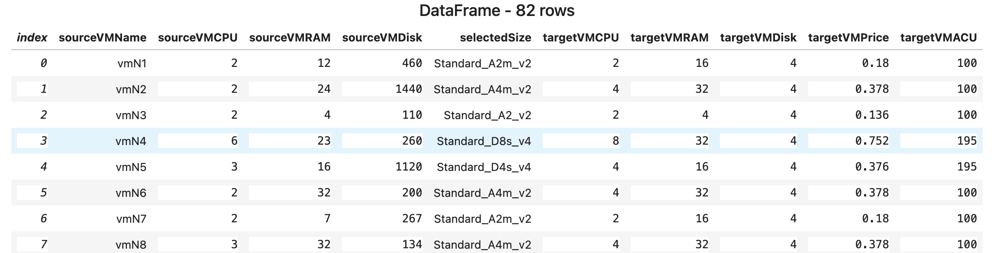
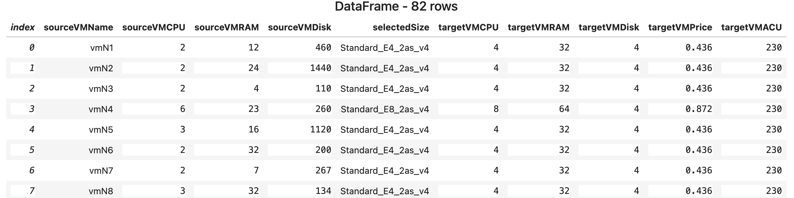
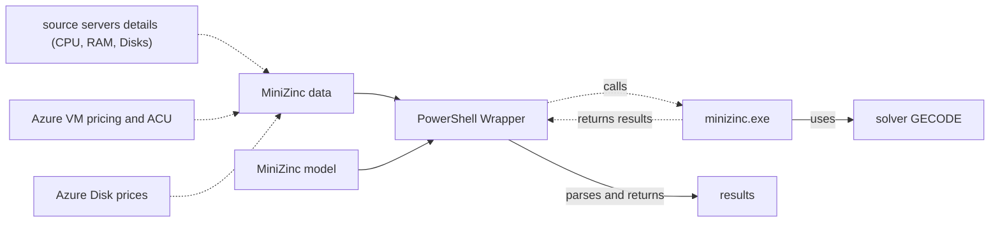

Are you considering transitioning your servers from an on-prem DC to Azure cloud? One step in this journey involves mapping existing servers to their Azure counterparts. The goal is to reduce the costs of the overall bundle of boxes while obtaining the highest possible performance. In theory, we can map the source VMs to the target VMs based on the number of virtual CPUs and the amount of RAM. Although this isn't the most challenging task, it doesn't guarantee the highest possible performance for the lowest possible price. If we always opt for a VM with the lowest price, we may compromise on performance. Conversely, choosing VMs with the highest performance could result in higher costs. Is there a middle ground? Is it possible to achieve what we want? Let's find out.

## MiniZinc

Our starting point is MiniZinc. Here's what they say about it on their website:


<div class="note">
<p>MiniZinc is a free and open-source constraint modeling language.</p>

<p>You can use MiniZinc to model constraint satisfaction and optimization problems in a high-level, solver-independent way, taking advantage of a large library of pre-defined constraints. Your model is then compiled into FlatZinc, a solver input language that is understood by a wide range of solvers.</p>

<p>MiniZinc is developed at Monash University in collaboration with Data61 Decision Sciences and the University of Melbourne.</p>
</div>

In simple terms, MiniZinc serves as a special declarative programming language for describing and solving a specific class of problems. It also acts as an abstraction layer over a set of solvers, allowing us to write a piece of code once and then attempt to solve a problem using different solvers.

In our case, we are solving the constraint satisfaction and optimization problem using MiniZinc.

## What we are going to do

In this section, we will conduct a quick experiment, analyze the result, and explain it. The next section contains some high-level details on how all this works. Please note, for all this to work directly on a Windows system, you may need to download and install [MiniZinc](https://www.minizinc.org/). Also, ensure that minizinc.exe is on the PATH.

> There is a helper script [here](https://github.com/eosfor/scripting-notes/blob/main/notebooks/en/vm-optimization-minizinc/helperFunctions.ps1). It sets up the stage for the experiment.

Let's simplify things initially. Our solution contains three major parts:

- [The MiniZinc model](https://github.com/eosfor/scripting-notes/blob/main/notebooks/en/vm-optimization-minizinc/vmCostsCalculation-integer.mzn), written in MiniZinc
- The input [data](https://github.com/eosfor/scripting-notes/blob/main/notebooks/en/vm-optimization-minizinc/vmData-integer.dzn) for the model
- A few [scripts](https://github.com/eosfor/scripting-notes/blob/main/notebooks/en/vm-optimization-minizinc/helperFunctions.ps1) to simplify the look and feel of the tool

The input data includes the following:

- Information about the source set of servers, their CPU, RAM, and Disk
- Information about Azure VMs in the eastus2 region, exported from Azure
- Information about Azure disks, also exported from Azure

The model attempts to map each source server to its cloud counterpart, but at the same time, it adheres to the applied constraints we provide as part of the model. For instance, our model demands that the amount of RAM of the cloud VM should not be less than that of the source box.

In the best-case scenario, the solver guarantees that the solution is optimal.

To try all that, let's import all the necessary helpers - dot sourcing:

```pwsh
. .\vm-optimization-minizinc\helperFunctions.ps1
```

We are going to run three different tests:

- Simple test, where we optimize for costs and performance separately, to have some data to compare to
- `cost -> performance` test, where we first optimize for costs, then fix it and optimize for performance. It means that we first find the minimal price and then try to find what we can to increase performance without exceeding the cost limit
- `performance -> cost` test, where we first optimize for performance, then fix it and optimize for costs. It means that we first find the maximum performance and then see if we can adjust a set of VMs so that cost reduces but without affecting the performance.

## Simple test - optimizing separately

Minimize the cost:

```pwsh
Start-MinizincVMOptimizationModel -Costs
```

```console
totalPrice totalACU vmRecords
---------- -------- ---------
42.4778     9200 {@{sourceVMName=vmN1; sourceVMCPU=2; sourceVMRAM=12; sourceVMDisk=460; selecte…
```

Maximize the performance:

```pwsh
Start-MinizincVMOptimizationModel -Performance
```

```console
totalPrice totalACU vmRecords
---------- -------- ---------
146.496    18860 {@{sourceVMName=vmN1; sourceVMCPU=2; sourceVMRAM=12; sourceVMDisk=460; selecte…
```

As seen from these results, the price in the first case is significantly lower than in the second case. I also want to highlight that the numbers show that doubling the performance costs us over three times more. Now the question is, can we do better?

## Minimize the cost for the price of performance

We use what Microsoft calls [Azure Compute Unit (ACU)](https://docs.microsoft.com/en-us/azure/virtual-machines/acu) to estimate the performance. We pull this value from Azure APIs, and in the future, I'll show you how to do it. In our experiments, we are trying to maximize it, keeping the cost as low as we can.

In this experiment, we first minimize the cost and then try to maximize the performance of the resulting set of target VMs:

```powershell
$ret = Start-MinizincVMOptimizationModel -Costs | Start-MinizincVMOptimizationModel -Performance
$ret
```

```console
totalPrice totalACU vmRecords
---------- -------- ---------
42.4778     9410 {@{sourceVMName=vmN1; sourceVMCPU=2; sourceVMRAM=12; sourceVMDisk=460; selecte…
```

Here we see that, compared to the first test, the cost remains minimal. But we managed to increase the overall performance slightly.

Let's see which VM sizes the model has picked for us. For that, we'll use the [DataFrame](https://devblogs.microsoft.com/dotnet/an-introduction-to-dataframe/). The .NET Interactive can display it conveniently, making it readable. To achieve this, we
need to convert the resulting set of VMs into a CSV string and then pass it to the extension method. Well, it doesn't look like an extension method, but it is. Unfortunately, this is how PowerShell does it.

```powershell
$csv = ($ret.vmRecords | ConvertTo-Csv -NoTypeInformation) -join "`n"
$df = [Microsoft.Data.Analysis.DataFrame]::LoadCsvFromString($csv)
[Microsoft.DotNet.Interactive.Kernel]::display($df)
```


The thing to pay attention to here is the `targetVMACU` column. It is always equal to 100. I did not check but assume that this is what helped to increase the performance slightly.

Actually, it's not necessary to use DataFrames. We can use HTML and the extension method, but if the table is big it shows a long list of rows, which is a bit inconvenient.

```C#
$view = $ret.vmRecords | ConvertTo-Html -Fragment
[Microsoft.DotNet.Interactive.Kernel]::HTML($view) | Out-Display
```

## Minimize cost without affecting performance

Now we want to try a different approach. We first maximize performance, pin it, and then try to minimize the total price by asking the model to reshuffle VMs to see if it's possible.

```powershell
$ret2 = Start-MinizincVMOptimizationModel -Performance | Start-MinizincVMOptimizationModel -Costs
$ret2
```

```console
totalPrice totalACU vmRecords
---------- -------- ---------
54.936    18860 {@{sourceVMName=vmN1; sourceVMCPU=2; sourceVMRAM=12; sourceVMDisk=460; selecte…
```

And here we go! We obtain a total price that is just slightly higher than the minimal one, but with doubled performance! That is a win, I think!

```powershell
$csv = ($ret2.vmRecords | ConvertTo-Csv -NoTypeInformation) -join "`n"
$df2 = [Microsoft.Data.Analysis.DataFrame]::LoadCsvFromString($csv)
[Microsoft.DotNet.Interactive.Kernel]::display($df2)
```


The model chose completely different VM sizes, which helped lower the cost without affecting the performance.

## How it really works

This section is for those who want to peek under the hood. But if you really want to dig deeper, it's better to watch a few courses below:

- [Basic Modeling for Discrete Optimization](https://www.coursera.org/learn/basic-modeling)
- [Advanced Modeling for Discrete Optimization](https://www.coursera.org/learn/advanced-modeling)

The overall solution diagram is below:



The main piece of the solution is the [model](https://github.com/eosfor/scripting-notes/blob/main/notebooks/en/vm-optimization-minizinc/vmCostsCalculation-integer.mzn). As I mentioned before, the model uses a declarative approach to describe what we need. And that is the beauty of it. We don't need to tell it how to find a solution. We define a model in the form of variables we want to find, constraints, and objective functions. And the model finds a solution for us by itself. Let's see how it's done in our case:

The first constraint of the model requires that for all source servers we want to find a target counterpart such that the amount of RAM on it is more or equal to the source VM.

```console
constraint forall(vm in existingVMs)(
    vmSizeRAM[selectedSize[vm]] >= vmRAM[vm]
);
```

The second constraint for the CPU is similar, but in this case, we allow it to be lower by 20%. It doesn't mean that all VMs are going to have fewer CPUs; it's just the lower boundary to save costs a bit.

```console
constraint forall(vm in existingVMs)(
   vmSizeCPU[selectedSize[vm]] >=  vmCPU[vm] * 0.8
);
```

Besides that, we have two objective functions: the total price and the total ACU. Each of them is just a sum of the corresponding values of all target VMs which our model is going to pick.

```console
var int: totalPrice = sum(vm in existingVMs)(vmSizePrice[selectedSize[vm]]);
var int: totalACU = sum(vm in existingVMs)( vmSizeACU[selectedSize[vm]] );
```

And last but not least - `decision variables`, actually what we are looking for. Here we simply say that for each VM in the input array we want to find a corresponding VM size in the cloud, in a way that satisfies our constraints. Basically, we define an array of `decision variables` which our solver will try to calculate for us.

```console
array[existingVMs] of var vmSizes: selectedSize;
```

For all to work, the model lacks a statement that should tell which of the objective functions we want to optimize and how. For that, there is the `solve` keyword. There are a few options here:

- `solve satisfy` - seeks for any/all solutions which satisfy given constraints
- `solve minimize ...` - tries to minimize the objective function and satisfy constraints
- `solve maximize ...` - tries to maximize the objective function and satisfy constraints

In our implementation, the `Start-MinizincVMOptimizationModel` cmdlet plugs the correct `solve` operator into the model and runs it by calling MiniZinc.

However, by default, MiniZinc does not have syntax to optimize for multiple parameters at a time. So we need to run the model twice. First, we run the model optimizing for one function, then get the result, supply it back to the model as a constraint, and try optimizing for the second function. That's exactly what this pipeline does: `Start-MinizincVMOptimizationModel -Costs | Start-MinizincVMOptimizationModel -Performance`.

1. Plug `solve  minimize totalPrice;` into the model.
2. The model executes, PowerShell takes the output from MiniZinc, parses it, and passes it to the next command via the PowerShell pipeline.
3. This input gets transformed into a constraint + another `solve` statement - `constraint totalACU >= $($InputObject.totalACU); solve  minimize totalPrice;` or `constraint totalPrice <= $($InputObject.totalPrice * 10000); solve  maximize totalACU;` where `$($InputObject.xxx)` is the result from the previous command.
4. The model executes, PowerShell takes the output from MiniZinc, parses it, and passes it to the next command via the PowerShell pipeline.

In the end, here's what is happening. The input to the model is the set of VMs with their sizes and all possible target VM sizes along with their attributes and ACU from Azure. For each VM, the model tries to find a counterpart from the list of sizes that satisfies all constraints and at the same time tries to optimize the objective function.