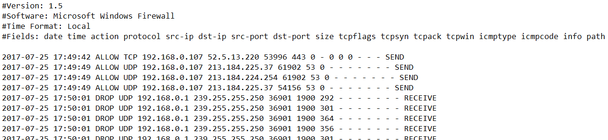
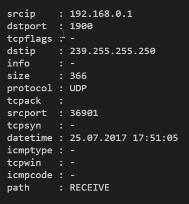
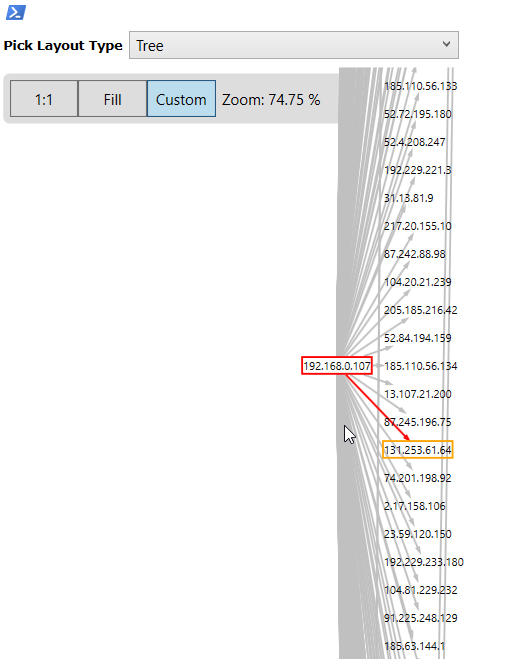

We live in logs, but what if you could _see_ them?

🕵️‍♂️ Today, we're going to turn **boring Windows Firewall logs** into **beautiful network graphs** using nothing but PowerShell and a sprinkle of technomagic. Whether you're a blue teamer, a lab explorer, or just someone who likes to turn plaintext into pretty pictures — this one's for you.

---

First, we need data. And by "data" I mean **logs full of noise and secrets**. To get yours, just follow [this Microsoft Technet article](https://technet.microsoft.com/en-us/library/cc947815(v=ws.10).aspx) and enable Windows Firewall Logging. I usually throw the logs into a dedicated folder like `C:\Temp`, because... chaos needs boundaries.

Here’s how it looks:



Structured? ✅  
Readable? 🤕  
Let's turn that into something PowerShell can digest.

---

## Parsing the logs

We’re going to use a giant regex (don’t run away) to match each line and create structured objects. Here's how you do that:

```powershell
$f = gc "C:\Temp\pfirewall_public.log"
$regex = '^(?\<datetime\>\d{4,4}-\d{2,2}-\d{2,2}\s\d{2}:\d{2}:\d{2})\s(?\<action\>\w+)\s(?\<protocol\>\w+)\s(?\<srcip\>\b(?:\d{1,3}\.){3}\d{1,3}\b)\s(?\<dstip\>\b(?:\d{1,3}\.){3}\d{1,3}\b)\s(?\<srcport\>\d{1,5})\s(?\<dstport\>\d{1,5})\s(?\<size\>\d+|-)\s(?\<tcpflags\>\d+|-)\s(?\<tcpsyn\>\d+|-)\s(?\<tcpack\>\d+|-)\s(?\<tcpwin\>\d+|-)\s(?\<icmptype\>\d+|-)\s(?\<icmpcode\>\d+|-)\s(?\<info\>\d+|-)\s(?\<path\>.+)$'

$log =
$f | % {
    $_ -match $regex | Out-Null
    if ($Matches) {
    [PSCustomObject]@{
        action   = $Matches.action
        srcip    = [ipaddress]$Matches.srcip
        dstport  = $Matches.dstport
        tcpflags = $Matches.tcpflags
        dstip    = [ipaddress]$Matches.dstip
        info     = $Matches.info
        size     = $Matches.size
        protocol = $Matches.protocol
        tcpack   = $Matches.tcpack
        srcport  = $Matches.srcport
        tcpsyn   = $Matches.tcpsyn
        datetime = [datetime]$Matches.datetime
        icmptype = $Matches.icmptype
        tcpwin   = $Matches.tcpwin
        icmpcode = $Matches.icmpcode
        path     = $Matches.path
    }
    }
} 
```

Yes, it’s a monster regex. But once tamed, it turns your file into a rich array of structured records. Notice how we cast datetime and IP fields so we can later filter and sort like real grownups.

Here’s what the end result looks like:



---

## From log lines to graphs

Each line is an edge. But to make it a graph, we need nodes and edges. PowerShell makes that delightfully simple if you’re using a graph module:

```pwsh
$g = new-graph -Type BidirectionalGraph
$log | ? {$_.srcip -and $_.dstip} | % {
    Add-Edge -From $_.srcip -To $_.dstip -Graph $g | out-null
}
```

And voilà, now $g is your graph.

You want to see it?

```pwsh
Show-GraphLayout -Graph $g
```



Okay, this one is just my laptop. But you get the idea. If you had logs from a bunch of machines or a segment — you’d start seeing network shape and intent.

---

## Time filters for focused views

Let’s say you only want to see traffic from the last hour. Slice it like this:

```pwsh
$d = ($log | sort datetime -Descending | select -First 1).datetime.addhours(-1)
$twoHrsLog = $log.Where({$_.datetime -gt $d})
$g1 = new-graph -Type BidirectionalGraph
$twoHrsLog | ? {$_.srcip -and $_.dstip} | % {
    Add-Edge -From $_.srcip -To $_.dstip -Graph $g1 | out-null
}
Show-GraphLayout -Graph $g1
```

Now you’ve got a temporal snapshot. Same logic works for ranges, windows, bursts of traffic.

---

Selective subgraphs based on edge degrees

Want to zoom in on just the “chattiest” nodes? Here’s one way:

```pwsh
$g2 = new-graph -Type BidirectionalGraph
$x = $g.Vertices.Where({$g.OutDegree($_) -gt 0})
$x | where {$_ -ne '192.168.0.107'} | % {$e = $g.InEdges($_); if ($e) {$e | % {add-edge -from $_.source -to $_.target -Graph $g2}}}
$x | where {$_ -ne '192.168.0.107'} | % {$e = $g.OutEdges($_); if ($e) {$e | % {add-edge -from $_.source -to $_.target -Graph $g2}}}

Show-GraphLayout -Graph $g2
```

Now you’re not just visualizing traffic — you’re analyzing behavioral patterns. “Who talks a lot, to whom, and when” — that’s actionable data.

---

## Full walkthrough

If you’re lazy like me (or just efficient), here’s the full script in one go:

```pwsh
#file and regular expression
$f = gc "C:\Temp\pfirewall_public.log"
$regex = '^(?<datetime>\d{4,4}-\d{2,2}-\d{2,2}\s\d{2}:\d{2}:\d{2})\s(?<action>\w+)\s(?<protocol>\w+)\s(?<srcip>\b(?:\d{1,3}\.){3}\d{1,3}\b)\s(?<dstip>\b(?:\d{1,3}\.){3}\d{1,3}\b)\s(?<srcport>\d{1,5})\s(?<dstport>\d{1,5})\s(?<size>\d+|-)\s(?<tcpflags>\d+|-)\s(?<tcpsyn>\d+|-)\s(?<tcpack>\d+|-)\s(?<tcpwin>\d+|-)\s(?<icmptype>\d+|-)\s(?<icmpcode>\d+|-)\s(?<info>\d+|-)\s(?<path>.+)$'

#parsing
$log =
$f | % {
    $_ -match $regex | Out-Null
    if ($Matches) {
    [PSCustomObject]@{
        action   = $Matches.action
        srcip    = [ipaddress]$Matches.srcip
        dstport  = $Matches.dstport
        tcpflags = $Matches.tcpflags
        dstip    = [ipaddress]$Matches.dstip
        info     = $Matches.info
        size     = $Matches.size
        protocol = $Matches.protocol
        tcpack   = $Matches.tcpack
        srcport  = $Matches.srcport
        tcpsyn   = $Matches.tcpsyn
        datetime = [datetime]$Matches.datetime
        icmptype = $Matches.icmptype
        tcpwin   = $Matches.tcpwin
        icmpcode = $Matches.icmpcode
        path     = $Matches.path
    }
    }
}
 #whole graph
$g = new-graph -Type BidirectionalGraph
$log | ? {$_.srcip -and $_.dstip} | % {
    Add-Edge -From $_.srcip -To $_.dstip -Graph $g | out-null
}

Show-GraphLayout -Graph $g

#subset of log records filterd by time
$d = ($log | sort datetime -Descending | select -First 1).datetime.addhours(-1)
$twoHrsLog = $log.Where({$_.datetime -gt $d})
$g1 = new-graph -Type BidirectionalGraph
$twoHrsLog | ? {$_.srcip -and $_.dstip} | % {
    Add-Edge -From $_.srcip -To $_.dstip -Graph $g1 | out-null
}

Show-GraphLayout -Graph $g1

#subset of log records filtered by degree of edges
$g2 = new-graph -Type BidirectionalGraph
$x = $g.Vertices.Where({$g.OutDegree($_) -gt 0})
$x | where {$_ -ne '192.168.0.107'} | % {$e = $g.InEdges($_); if ($e) {$e | % {add-edge -from $_.source -to $_.target -Graph $g2}}}
$x | where {$_ -ne '192.168.0.107'} | % {$e = $g.OutEdges($_); if ($e) {$e | % {add-edge -from $_.source -to $_.target -Graph $g2}}}
Show-GraphLayout -Graph $g2
```

If logs are your thing, then graphs are your superpower. 🕸️
