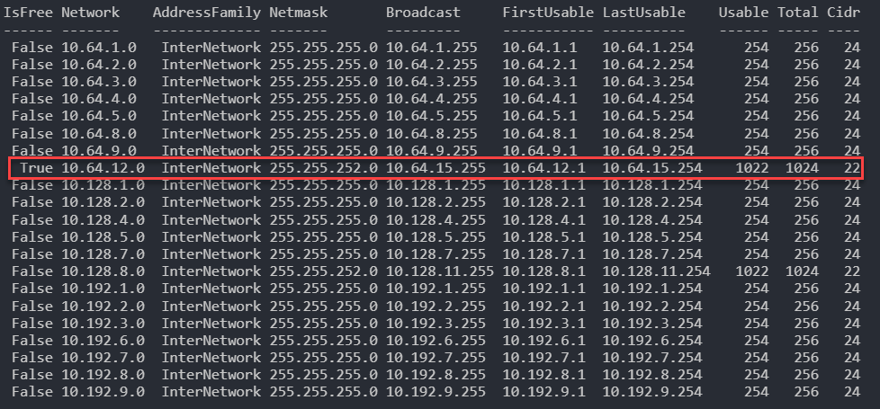
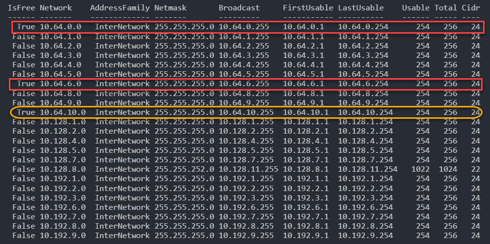
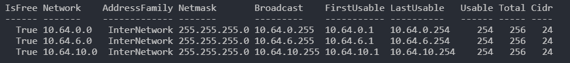
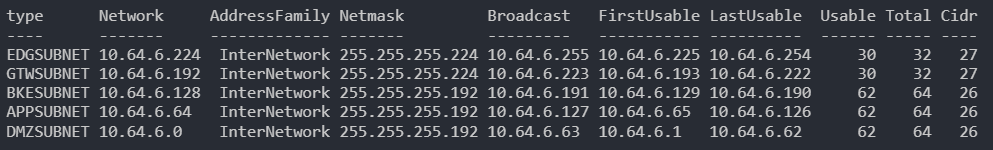

Assume we've got three different ranges '10.192.0.0/11', '10.64.0.0/11' and '10.128.0.0/11'. These ranges correspond to three different geographic locations in Azure. There are already some ranges used in these top level blocks. And we have the whole list of ranges, which are in use already. So what we want to achieve is we want to automatically select the next available range and provision VNET for it.

# The process

Lets say we've extracted all VNET ranges and got their list, like this:

```powershell
$nets = '10.192.1.0/24','10.192.2.0/24','10.192.3.0/24','10.192.6.0/24',
        '10.192.7.0/24','10.192.8.0/24','10.192.9.0/24','10.64.1.0/24',
        '10.64.2.0/24','10.64.3.0/24','10.64.4.0/24','10.64.5.0/24',
        '10.64.8.0/24','10.64.9.0/24','10.128.1.0/24','10.128.2.0/24',
        '10.128.4.0/24','10.128.5.0/24','10.128.7.0/24','10.128.8.0/22'
```
Assume we need to find the next range of size /22 in the network '10.64.0.0/11'. We do it this way:

```powershell
Get-IPRanges -Networks $nets -CIDR 22 -BaseNet "10.64.0.0/11" | ft -AutoSize
```



What this output shows is the list of your networks, marked by IsFree flag. Basically, it assumes that if the range is in the list, then it is in use. The row, where IsFree is true, is the range that the commandlet identified as a next available slot for your network. Lets try another one

```powershell
Get-IPRanges -Networks $nets -CIDR 24 -BaseNet "10.64.0.0/11" | ft -AutoSize
```

In this case output is a bit different. First two ranges, which have been identified fits one of free slots that the base network range has. And the last one, is the slot at the end of the list of occupied ranges.



So if we want to filter out just those, that we are interested in, we can do like below, so we can pick one of these.

```powershell
Get-IPRanges -Networks $nets -CIDR 24 -BaseNet "10.64.0.0/11" | ? isfree -eq $true | ft -AutoSize
```



Ok, lets say we've chosen '10.64.6.0/24'. Next step is to break it down by subnets, if needed. Let say that because of some corporate policies we want to have four subnets in this VNET. First subnet will be reserved for Gateway subnet, then we have a DMZ subnet, to put our WAF, as no other devices is supported in the WAF subnet. Next subnet, we call it EDGE - is basically a subnet we put put our WEB-facing VMs into, then APP - for application layer, and BKE - for data layer. In order to do this automatically we need to have a range we picked up on the previous step. And we need to define a layout. We need also to specify a size of each subnet in number of IPs. Like below.

```powershell
$subnets = @{type = "GTWSUBNET"; size = 30},
@{type = "DMZSUBNET"; size = 62},
@{type = "EDGSUBNET"; size = 30},
@{type = "APPSUBNET"; size = 62},
@{type = "BKESUBNET"; size = 62}

Get-VLSMBreakdown -Network 10.64.6.0/24 -SubnetSize $subnets | ft -AutoSize
```

This will be our VNET breakdown, by subnets

