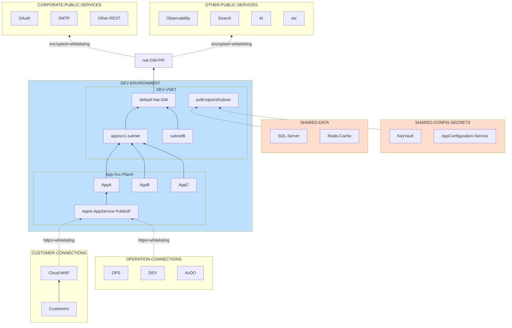

In the journey of infrastructure creation within Azure, many organizations lean towards crafting complex hub-and-spoke topologies to host their applications, even when the necessity for such complexity isn’t apparent. A common justification echoes: “It’s mandated by the [Microsoft Cloud Adoption Framework (CAF)](https://learn.microsoft.com/en-us/azure/cloud-adoption-framework/)”. However, embarking on this path unfolds a myriad of related, albeit previously unexplored, domains. For instance, the newfound need to manage IP spaces, delve into VLSM subnetting - topics unfamiliar to most Dev teams. Once networked, the quest doesn’t end; it merely morphs into challenges like private DNS resolution, establishing access to internal resources, and the list trails on.

Yet, if we pause to reflect, many Azure services including Azure Web Apps were designed with a public persona. Initially, some didn’t even entertain VNET integration, and this model was well-accepted.

In this article, we aim to traverse a less convoluted route towards securely hosting Web Apps, whilst sidestepping the network-centric hurdles.
<!--more-->

Our compass is pointed towards simplicity, without trading off security. This simplicity envelops both the infrastructure architecture and the provisioning templates, ensuring a streamlined automation process. Our discourse unfolds the potential of maintaining a straightforward yet secure architecture, shedding the excess, and focusing on what truly matters for running Web Apps securely in Azure.

- [Overview](#overview)
  - [A word on naming conventions](#a-word-on-naming-conventions)
- [Provision infrastructure](#provision-infrastructure)
  - [Logging in to Azure](#logging-in-to-azure)
  - [Create shared resources](#create-shared-resources)
  - [Create new environment](#create-new-environment)
  - [Interconnect shared elements and environments](#interconnect-shared-elements-and-environments)
- [Deploy Web Apps](#deploy-web-apps)
  - [Cleanup](#cleanup)


## Overview

The provided diagram visually illustrates the architecture of a typical application setup, primarily operating on Web Apps. These Web Apps are housed within a Virtual Network (VNET) utilizing the Web App VNET integration feature. Unfortunately, we have no other choice but to incorporate a VNET here. Azure Web Apps do not offer a simple method to assign a static public IP to them. Thus, we leverage a VNET and a NAT Gateway, ensuring the outgoing traffic has a well-known public IP, which allows our Applications to be easily whitelisted on corporate resources or any other public service. What helps simplify this setup is that we do not plan to connect it to any external network. Thus, we can always use the same 10.0.0.0/8 range, which almost completely eliminates the need for IP address management.

As long as we still have a "stub" VNET, we can also use private endpoints to connect to backend services. This, however, is not necessary if you can whitelist the NAT Gateway public IP on them. That would simplify everything even more. However, not all services support service-level firewall; for example, Azure App Configuration I use does not have such a feature. In this architecture, I aimed for a unified approach, thus I did not want some backend services to use Private Link, and others to use whitelisting as a security measure. This is the only reason I decided to go a harder way and connect all backend services using Private Endpoints. Generally speaking, if only App Configuration supported service-level firewall, I'd go without private endpoints. Automation would have become much simpler in this case.

On the other hand, outgoing traffic from Web Apps follows a standard path from the public endpoints of each Web App. Some Web Apps might have public access turned off, while others can be made available as needed. For security reasons, we only allow certain IPs to perform management activities. All this makes it possible to have a "private" version of Web Apps, as we can whitelist them to each particular developer. We can also employ a Cloud Web Application Firewall (WAF), like Cloudflare WAF, to let customers' traffic through, and allow only communications coming from the WAF into Web Apps.

Security-wise, we can assert that on L3 we can ensure that only well-known ranges can establish TCP connections to our public endpoints. Inside these "allowed tunnels", all traffic is encrypted. Last but not least, we MUST mandate cross-service authentication between all communicating endpoints. Mutual authentication is better if possible.

Here are some benefits of this approach:

1. **Simplicity and Adjustability**: Getting rid of extra complexity related to VNETs simplifies the infrastructure and makes it easy to make changes.
2. **VM-free Environment**: No need for temporary VMs, jump-boxes, or similar resources.
3. **Accessibility**: Allows DEV teams to access remotely while keeping things private through whitelisting, without the hassle of VPN or DNS/hosts file configurations.
4. **Cost Efficiency**: Uses only necessary resources, avoiding extra costs from support components like Firewalls.



In terms of implementation, we can categorize and outline several key components:

- **Environment**: This encompasses application-level resources. Essentially, it houses elements that support hosting applications, such as Web Apps, and associated services.
- **Data Services**: This component manages all data-centric elements like databases, caches, and other related services.
- **Configuration and Secrets**: This segment is dedicated to the shared configuration service and secret management.

The major attributes used to draw a line between these elements are access and ownership. Development teams typically own and manage Application environments, so we want them to have the flexibility to create environments whenever they need them in `NON-PROD` environments. In `PROD`, it is a good practice to grant them at least read access, so they can help troubleshoot when something goes wrong. On the other hand, someone else for security reasons may manage the Data layer and Configuration/Secrets in `PROD`. And because of this, we want to keep them in a separate Resource group each. This setup provides an opportunity to manage access permissions separately.

Furthermore, another objective is to retain the autonomy of these segments. This approach minimizes interdependencies in provisioning templates. Typically, when templates are interdependent, you have to think about interfacing them. However, each time you cross a border of a Resource group, you add additional parameters and complexity to your templates. A classic example is when you provision Web Apps, you need to supply some details about the underlying network, which someone created elsewhere. The same goes for App Service plans; if you added one more, your Web App automation might not know about this fact, so it has to adjust. The last example is delegated subnets: App Service plans do not have any details on what subnets they are using, so when you create a Web App and attach it to a Plan, you must make sure that you also attach it to the subnet all other Web Apps in this plan are attached to. All this makes the template bundle difficult to create and maintain as time goes by and infrastructure changes.

Instead of putting this complexity into relatively static Bicep templates, we want to employ a [mediator pattern](https://en.wikipedia.org/wiki/Mediator_pattern), meaning we want to create an `interconnect component` with the following characteristics and benefits:

The 'interconnect' acts as a bridge between the outlined components, ensuring they communicate and interact seamlessly while maintaining their independence. Here are several reasons and benefits for making 'interconnect' a separate component:

  1. **Simplified Management**: By isolating the interconnection logic into a separate component, you simplify the management of each environment. This division of concerns allows for easier troubleshooting and updates as you can modify the interconnect component independently without affecting other components.
  2. **Dynamic Connectivity**: The 'interconnect' component can dynamically establish connections between different environments and shared resources. This dynamic nature facilitates flexibility and adaptability, allowing for changes in one environment without requiring manual reconfiguration of connections.
  3. **Automatic Provisioning**: The 'interconnect' component can automate the process of identifying resources, creating necessary DNS zones, and establishing private links/endpoints. This automation significantly reduces the administrative overhead, making the process of adding or modifying resources more streamlined.
  4. **Reduced Template Complexity**: By handling the interconnections separately, you greatly reduce the complexity of Bicep or ARM templates for each environment. This separation results in smaller, more manageable templates that are easier to understand and maintain.
  5. **Enhanced Security and Privacy**: Establishing connections through a dedicated 'interconnect' component allows for centralized control over access and communication between environments and shared resources. This central control is crucial for enforcing security policies and ensuring the privacy of data communication.
  6. **Scalability**: As your infrastructure grows, the 'interconnect' component can scale to manage increased interconnections without requiring changes in the architecture of individual environments or shared resources.
  7. **Consistency and Standardization**: Having a dedicated 'interconnect' component ensures consistency in how connections are established and managed across various environments. This consistency is critical for maintaining standard operational procedures and ensuring compliance with organizational or regulatory requirements.
  8. **Cost Efficiency**: Automating the interconnection process can lead to cost savings by reducing the time and effort required to manage connections manually. This efficiency is particularly beneficial in large-scale or rapidly changing infrastructures.

In conclusion, the 'interconnect' component encapsulates the logic and operations necessary for establishing and managing connections between different components. This encapsulation aligns well with the mediator pattern, promoting a cleaner, more organized, and efficient infrastructure setup.

This results in us delineating four distinct components of our system:

1. Application Environment or Application Layer
2. Data Layer
3. Configuration Layer
4. Interconnect: A script designed to execute all essential configurations, linking the Application Environment with both the Data and Configuration Layers.

### A word on naming conventions

Avoiding naming conventions, particularly in the dynamic environment of Azure, is a strategic choice rooted in both practicality and foresight. Here's why:

- **Anticipated Complexity**: Naming conventions, though created with the intention of simplifying identification, paradoxically introduce an added layer of complexity. This complexity isn't merely the formulation of rules but ensuring consistent adherence to them. It necessitates the development of additional software modules, tailor-made to comply with Azure’s unique naming stipulations. This, in turn, translates to extra developmental work, and by extension, more room for error.
- **Inevitable Bottlenecks**: Imagine the scenario where a novel resource type emerges or a resource doesn't align seamlessly with our naming algorithm. The response, in a convention-bound environment, isn't swift adaptation but waiting – waiting for the naming tool to be updated, tested, and deployed. This latency doesn't just impede efficiency; it stifles innovation.
- **Redundancy and Over-Reliance**: Encoding resource attributes like type, location, or other metadata into its name, while it might seem intuitive, is redundant. Azure inherently recognizes the nuances of each resource. Hardcoding this information is like adding a subtitle to a translated document; it's unnecessary. If ever in doubt, Azure can be queried, ensuring you get the most accurate, up-to-date information without relying on the potential pitfalls of human-encoded conventions.

In summation, while the appeal of naming conventions as a means to bring order might be tempting, it's crucial to assess the long-term implications, potential redundancies, and the stifling of adaptability they can introduce. In a domain as dynamic as Azure, flexibility and agility should always be at the forefront.

The better approach is to avoid any assumptions about names, let them be anything meaninful for users. Instead rely on metadata Azure can provide, like resource types, tags etc., dynamically querying resource objects when needed.

## Provision infrastructure

Now lets make it all to life. 

> The section below is provided for reference. You can try all this yourself in [Binder](https://mybinder.org/v2/gh/eosfor/scripting-notes/HEAD).
> All source code is in the repo [here](https://github.com/eosfor/scripting-notes/tree/main/notebooks/en)

### Logging in to Azure

Let's first import a PS module and login to Azure. Here we use `UseDeviceAuthentication` as Jupyter notebooks may run in a container somewhere so they won't have a UI or a browser. We also load a small library of helper functions for the rest of our experiment

```powershell
Install-Module Az
```

```powershell
Import-Module az
```

```powershell
Login-AzAccount -UseDeviceAuthentication
```

We also need to import a [small PowerShell library](https://github.com/eosfor/scripting-notes/blob/main/notebooks/en/no-caf-webapps/helper3.ps1)

```powershell
. ./helper3.ps1
```

### Create shared resources

Now we are ready to create everything from scratch. To make it all repeatable we want to first create `SHARED` elements, so in future, when we need just Application environments, we can always skip these steps.

First we create resource groups:

```powershell {linenos=inline}
$sharedEnvironments = 'SHARED-DATA', 'SHARED-CONFIGURATION'
$location = 'westus'

$sharedEnvironments | % { 
    $resourceGroup = Get-AzResourceGroup -Name $_ -ErrorAction SilentlyContinue

    if (-not $resourceGroup) {
        # If it doesn't exist, create it
        New-AzResourceGroup -Name $_ -Location $location
    }
}
```

Then, apply templates.

```powershell
New-AzResourceGroupDeployment -Name 'shared-data-provisioning' -ResourceGroupName 'SHARED-DATA' -TemplateFile ./dataLayer.bicep
New-AzResourceGroupDeployment -Name 'shared-config-provisioning' -ResourceGroupName 'SHARED-CONFIGURATION' -TemplateFile ./configSecretsLayer.bicep
```

### Create new environment

The subsequent phase involves setting up the actual environment. Our intention is to avoid provisioning multiple environments simultaneously, considering we might wish to update only one at a time in the future. The section below establishes a Resource Group and an environment within it. If updates are required later on, simply provide a name along with an amended template.


```powershell {linenos=inline}
$environmentRg = 'DEV'
$location = 'westus'

$environmentRg | % { 
    $resourceGroup = Get-AzResourceGroup -Name $_ -ErrorAction SilentlyContinue

    if (-not $resourceGroup) {
        # If it doesn't exist, create it
        New-AzResourceGroup -Name $_ -Location $location
    }
}
$envProvisioningResults = New-AzResourceGroupDeployment -Name 'dev-env-provisioning' -ResourceGroupName $environmentRg -TemplateFile ./appLayer.bicep
```

### Interconnect shared elements and environments

Now it's time for `interconnect`. In this phase, we need to integrate `shared` resources into the new environment. However, this process needs to be somewhat dynamic, yet simple. We aim to specify which environments we wish to "connect," and allow the interconnect script to handle the rest. Here's what it does:
- Enumerates all resources in the `source` environment.
- Identifies and selects those resources that support Private Link/Private Endpoints, and integrates them into the `target` environment.
- Creates the necessary Private DNS zones for the identified services.
- Maps Private Endpoints to the corresponding Private DNS zones ensuring automatic registration therein.

This process effectively decouples environment Bicep templates from one another, which significantly simplifies them. Given that I only use a small number of resources, the templates remain compact and almost 100% independent. There's hardly a need for parameters within these templates as they are succinct enough to fit on a single screen. Another advantage is that if you decide to add more resources to the backend, the `interconnect` can detect and automatically attach them to the `target`, without requiring any modifications in the `target` template.


```powershell
Connect-Environment -SourceEnvResourceGroup 'SHARED-DATA' -TargetEnvResourceGroup 'DEV'
Connect-Environment -SourceEnvResourceGroup 'SHARED-CONFIGURATION' -TargetEnvResourceGroup 'DEV'
```

And here we have everything we need to start creating Web Apps.

## Deploy Web Apps

> The contents of this section is not actually a way do perform a deployment. This is the process and a set of scripted steps you can use in your CD process to automate application deployments.

Typically, when you create Web Apps you need to know an App Service Plan, which will run your Web App as well as the subnet, used by this plan. Unfortunately there is no direct link between a Plan and a subnet. This connection appears when you create a first Web App in the Plan and connect it to the network. All subsequent Web Apps must go tho the same subnet.

So, before you an actually create a Web App, you must determine these two pieces of information. The script below helps with this.


```powershell
$webAppMappingHtml = Get-AppServicePlanDetail -ResourceGroupName 'DEV'
```

After you've chosen a Plan to host your application, you can create new Web Apps as below. If there are no Web Apps in the plan, you should provide a vnet name and a subnet name. If there is at least one web app in the Plan, these values will be determined automagically.


```powershell
# no web apps yet
New-WebApp -ResourceGroupName 'DEV' -TargetAppSvcPlan 'dev1-appsvc-plan' -TargetSubnetName 'appsvc1-subnet' -TargetVnetName 'application-stub-vnet' -WebAppName  'testWebApp1-nbrylply'

# there is one now
New-WebApp -ResourceGroupName 'DEV' -TargetAppSvcPlan 'dev1-appsvc-plan' -WebAppName  'testWebApp2-nbrylply'
```

### Cleanup

Just a cleanup section


```powershell
Remove-AzWebApp -ResourceGroupName 'DEV' -Name 'testWebApp1-nbrylply' -Force
Remove-AzWebApp -ResourceGroupName 'DEV' -Name 'testWebApp2-nbrylply' -Force
```

```powershell
Remove-AzResourceGroup -ResourceGroupName 'DEV' -Force
Remove-AzResourceGroup -ResourceGroupName 'SHARED-DATA' -Force
Remove-AzResourceGroup -ResourceGroupName 'SHARED-CONFIGURATION' -Force
```