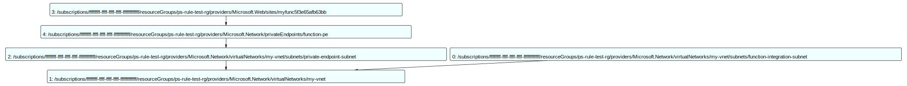

When validating Azure infrastructure, inspecting each resource individually is often not enough. For example, you might need to confirm that each Azure Function has exactly one private endpoint or that all resources are correctly integrated into a network. For such tasks, having the complete picture is crucial.

This is where two tools come in handy: `PSRule` and the `PSQuickGraph` module. In this post, I'll explain how to make these two work together and what benefits you can achieve.

<!-- MORE -->

## Introduction to PSRule and PSRule.Rules.Azure

When developing and maintaining Infrastructure as Code (IaC), it's essential not only to create but also to validate your templates against best practices and standards. [PSRule](https://github.com/microsoft/PSRule) is a cross-platform PowerShell module designed for validating IaC and other objects using customizable rules. It integrates seamlessly with popular continuous integration (CI) systems, automating the validation process.

[PSRule.Rules.Azure](https://github.com/Azure/PSRule.Rules.Azure) extends PSRule by providing a comprehensive set of predefined rules for validating Azure resources and IaC templates. It includes over 400 rules based on Azure Well-Architected Framework principles, helping developers and engineers ensure their infrastructure adheres to Microsoft's recommended practices.

One fantastic feature of PSRule is its ability to work with Azure Bicep templates. It expands your Bicep templates into native ARM objects and applies validation rules to these objects before deployment to Azure. This way, you can verify compliance with your requirements even before resources are provisioned — effectively providing static code analysis for Bicep.

However, until now ;), the typical scenario was to validate each object's configuration individually against rules, either your own or Microsoft's. The scenario I faced was slightly different.

## Our Scenario

In this scenario, we have several roles involved. First is the `Architect`, responsible for designing the architecture based on business, security, and technical requirements. The `Architect` creates detailed documentation, diagrams, and examples to describe the intended architecture clearly.

Once the architecture is defined, an `Engineer` joins the process. Their task is to implement the architecture using tools like `Bicep` and `PowerShell`.

However, sometimes it's challenging to communicate the architecture accurately, even with detailed documentation and diagrams. The more complex the infrastructure, the higher the risk of misinterpretation. After implementing the Bicep templates, the `Architect` must verify that the implementation matches their original intent. For this purpose, the `Architect` uses `PSRule`, which allows quick creation of rules to validate the Bicep code. These rules help confirm that the `Engineer` has implemented the architecture correctly.

## Technical Details

The validation process in PSRule functions like a pipeline. Objects from Bicep templates are first transformed into native Azure ARM format and then processed one by one through pipeline rules. Each object is considered individually, making it hard to validate complex dependencies, such as private endpoints. So, what's the solution?

The idea is simple: as resources flow through the PSRule pipeline, we gradually add them into a dependency graph using `PSQuickGraph`. Understanding how resources relate allows us to add vertices and edges accordingly. After all resources are processed, we review the entire graph to ensure correct relationships.

Using a standard `Rule` block isn't ideal for this additional processing since this logic isn't strictly a rule. PSRule provides a feature called [Conventions](https://microsoft.github.io/PSRule/v2/concepts/PSRule/en-US/about_PSRule_Conventions/) specifically for this purpose. A `Convention` allows custom logic to run at specific pipeline stages: before the pipeline, after each object, and at the end of the pipeline.

Here's how we implement it. We create a `Convention` with two blocks: the `-Process` block, executed for each object, and the `-End` block, executed after processing all objects.

In the `-Process` block, we check the resource type and accordingly add the necessary vertices and edges to the graph. For example, if the resource is a virtual network (VNET), we store its ID and link it to subnets:

```powershell
if ($TargetObject.type -eq 'Microsoft.Network/virtualNetworks') {
    $global:vnetId = $TargetObject.id

    foreach ($subnetResource in $TargetObject.resources) {
        Add-Edge -From $subnetResource.id -To $TargetObject.id -Graph $global:connectionGraph
    }
}
```

For Web Sites, we verify the VNET integration settings and add an edge to the graph:

```powershell
if ($TargetObject.type -eq 'Microsoft.Web/sites') {
    $vnetIntegrationObject = $TargetObject.resources |
        Where-Object { $_.Type -eq 'Microsoft.Web/sites/networkConfig' }

    $global:webSites += $TargetObject.id

    Add-Vertex -Graph $global:connectionGraph -Vertex $TargetObject.id
    Add-Edge -From $TargetObject.id -To $vnetIntegrationObject.properties.subnetResourceId -Graph $global:connectionGraph
}
```

At this stage, we guarantee all objects are processed, and the graph represents the complete infrastructure picture. Now we analyze the complete graph:

```powershell
# checking paths from each web app to VNET
foreach($webApp in $global:webSites){
    $p = Get-GraphPath -From $webApp -To $global:vnetId -Graph $global:connectionGraph
    if ($null -eq $p) {
        Throw "No path from the app to VNET"
    }
}
```

There's a slight challenge: At the end of the pipeline, standard PSRule methods like `$Assert` are unavailable, making it difficult to directly indicate if checks passed or failed. Currently, I resort to throwing exceptions and continue looking for a more elegant solution.

Additionally, graphs created with `PSQuickGraph` can be exported into svg for visualization:

```powershell
Export-Graph -Graph $global:connectionGraph -Format MSAGL_SUGIYAMA -Path ./output/graph.svg
```

This visualization is handy for quickly analyzing dependencies and identifying potential issues.



Thus, we conveniently separate data collection, graph building, and final validation. This ensures our Azure infrastructure matches the intended architecture.

And, of course you can try it all yourself in:

[](https://github.com/codespaces/new?repo=eosfor/psrule-demo&ref=main)

Have you faced similar challenges? I'd love to hear how you validate dependencies between Azure resources!